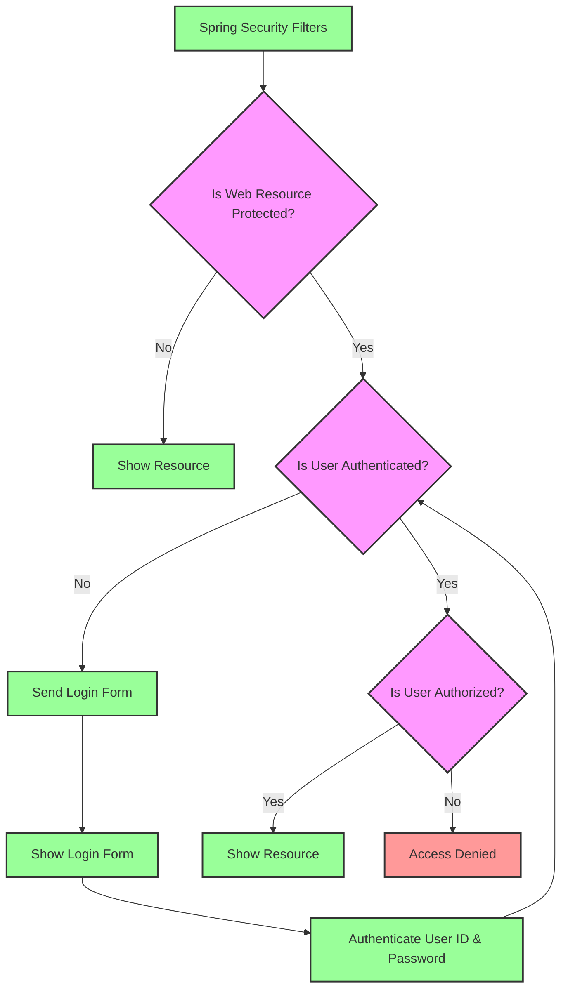

# Spring Security

**Spring Security Model**
- Spring Security defines a framework for security
- Implemented using Servlet filters in the background
- Two methods of securing an app : declarative and programmatic 

**Spring Security with Servlet Filters**
- Servlet Filters are used to pre-process/post-process web requests
- Servlet Filters can route web requests based on security logic 
- Spring provides a bulk of security functionalities with servlet filters

**Spring Security Overview**
- Web Browser -----> Spring Security Filters ------> Protected Web Resources (eg, /mytopsecretstuff)
- Protected Web Resources ------> Spring Security Filters --------> Web Browser
- Spring Security Filters ---> my app security configuration <-----> user, password, roles
  
**Spring Security in Action**

**Security Concepts**
- Authentication
  - Check user id and password with credentials stored in app/db
- Authorization
  - Check to see if user has an authorized role

**Declarative Security**
- Define application's security constraints in configuration
  - All Java config: @Configuration
- Provides separation of concerns between applications code and security

**Programmatic Security**
- Spring Security provides an API for custom application coding
- Provides greater customization for specific app requirements

**Enabling Spring Security**
- Edit pom.xml and add spring-boot-starter-security
- This will automatically secure all endpoints for application

**Cross-Site Request Forgery (CSRF)**
- Spring Security can protect against CSRF attacks
- Embed additional authentication data/token into all HTML forms
- On subsequent requests, web app will verify token before processing
- Primary use case is traditional web applications (HTML forms etc ...)

**When to use CSRF Protection**
- The Spring Security team recommends
  - Use CSRF protection for any normal browser web requests
  - Traditional web apps with HTML forms to add/modify data
- If you are building a REST API for non-browser clients
  - you may want to disable CSRF protection
- In general, not required for stateless REST APIs
  -  That use POST, PUT, DELETE and/or PATCH

**Spring Security Login Process**
- Retrieve password from db for the user
- Read the encoding algorithm id(bcrypt etc.)
- For case of bcrypt, encrypt plaintext password from login form (using salt from db password)
- Compare encrypted password from login form WITH encrypted from db
- If there is a match, login successful
- If not match, login NOT successful

**NOTE : The password from db is NEVER decrypted because bcrypt is one-way encryption algorithm**